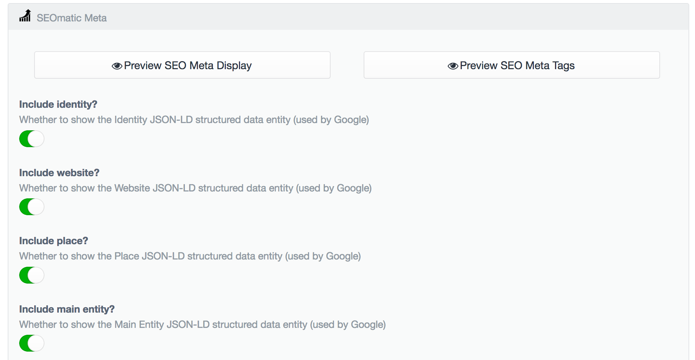

# SEOmatic plugin for Craft

This repository is a fork of `https://github.com/nystudio107/seomatic`.

## Installation

To install SEOmatic, follow these steps:

1. install with Composer via `composer require pod-point/seomatic`
2. Install plugin in the Craft Control Panel under Settings > Plugins

SEOmatic works on Craft 2.4.x, Craft 2.5.x, and Craft 2.6.x.

The SEOmetrics feature requires PHP 5.4 or later and that you have the [php-xml extension](http://osticket.com/forum/discussion/8702/php-fatal-error-call-to-undefined-function-utf8-encode-error-message) installed.

[Here you can see the documentation of the original repository](https://github.com/nystudio107/seomatic) we highly recommend to read it in order to have an overview of how it works.
[Here you can see the wiki of the original repository](https://github.com/nystudio107/seomatic/wiki).

## Overview

- We deleted all implementation of dublin core meta-datas from the original repository.
- We added the possibility for you to turn off separately JSON-LD Identity/Website/Place/Main entity per page.
- We added the possibility for you to specify a review plugin like [our reviewscoukcraft plugin](https://github.com/Pod-Point/reviewscoukcraft) for aggregate ratings related to product only [http://schema.org/AggregateRating](http://schema.org/AggregateRating).
- We added the possibility to specify all the offers displayed in your Product/Service page: [http://schema.org/Offer](http://schema.org/Offer)
- We added the possibility to specify in JSON-LD that your product page iz `Service`: [http://schema.org/Service](http://schema.org/Service)

## Turn off separately JSON-LD Identity/Website/Place/Main entity per page

- Edit your page in Entries
- Click on SEO tab
- You should see the following toggle buttons:

## Use a reviews plugin

In order to specify your review plugin just go to SEOmatic > Settings then:
- Set the category of products
- Set the Review plugin's handle (for example: for our reviewscoukcraft plugin the handle is `reviewsCoUkCraft` more information about plugin handle [here](https://craftcms.com/docs/plugins/setting-things-up#pick-a-name-and-handle))
- Set the URI to use in order to fetch products reviews (below you can specify a different URL for `aggregate ratings` about Services)
- (optional) You can specify the audienceType from [Audience](http://schema.org/Audience) that will be used for both Product and Services.
- (optional) You can specify the default [AreaServed](http://schema.org/areaServed) for your Services
- (optional) You can specify the default [Provider Mobility](http://schema.org/providerMobility) for your Services.

## Specify Offers displayed in your Products/Services pages in JSON-LD

In order to specify the different offers you have in your Product/Service page:
- Go to Settings > Fields > Product > New Field
- In 'Name' typed 'Offers'
- In 'Handle' typed 'productOffers'.
- Choose 'Matrix' as your Field Type
- Then click on 'New block type'
- In Name typed 'Offer'
- Then click on 'New Field'
- In Name typed 'Offer Name'
- Then click on 'New Field'
- In Name typed 'Offer Price'
- Click 'Save' on the top right corner
- Then go to Settings > Sections > and click on 'Edit entry type' related to 'Product Pages' and add the 'OFFERS' field to Product fields. [More informations about entry types here](https://craftcms.com/features/entry-types)
- Click 'Save' on the top right corner

Now if you edit your products entries via Entries > Product Pages > (edit any entry) you can add as much as you want.

## Specify that your Product is a Service in JSON-LD

In order to specify that a product is a Service:
- Go to Settings > Fields > Product > New Field
- In 'Name' typed 'Is a Service?'
- In 'Handle' typed 'productIsService'.
- Choose 'Radio Buttons' as your Field Type
- Then click on Add on Option
- In the first Option use 'Yes' as a label and 1 as a value
- In the second Option use 'No' as a label and 0 as a value (tick the 'default?' checkbox for this one).
- Click 'Save' on the top right corner
- Then go to Settings > Sections > and click on 'Edit entry type' related to 'Product Pages' and add the 'IS A SERVICE?' field to Product fields. [More informations about entry types here](https://craftcms.com/features/entry-types)
- Click 'Save' on the top right corner

## TODO
- Allow overiding reviews URI per product.
